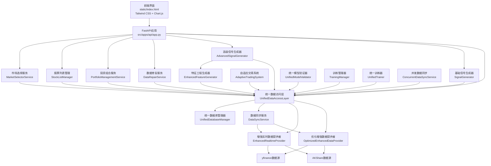
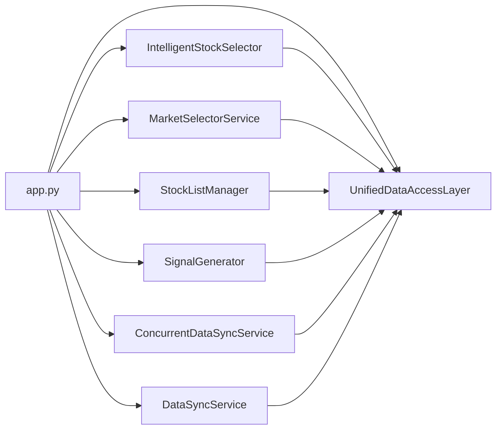
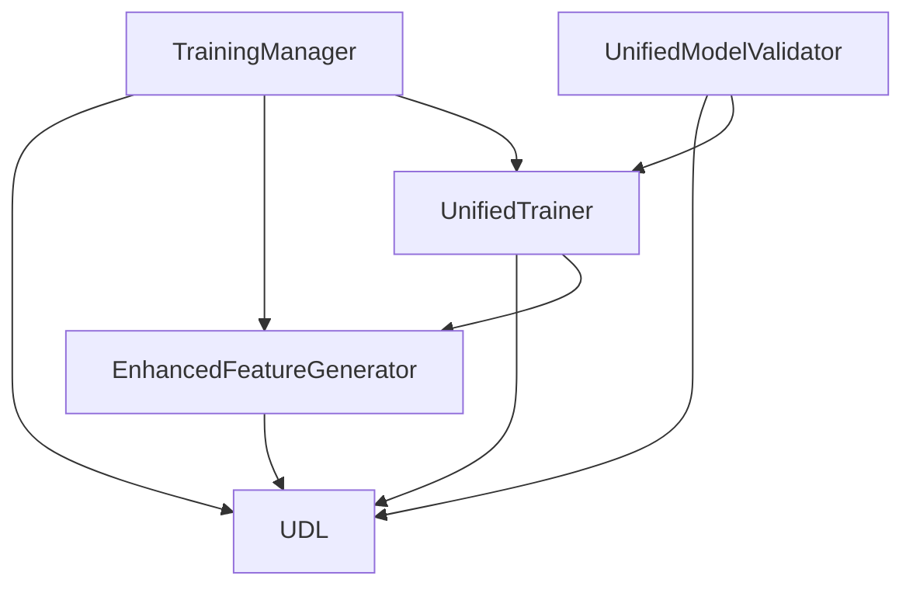
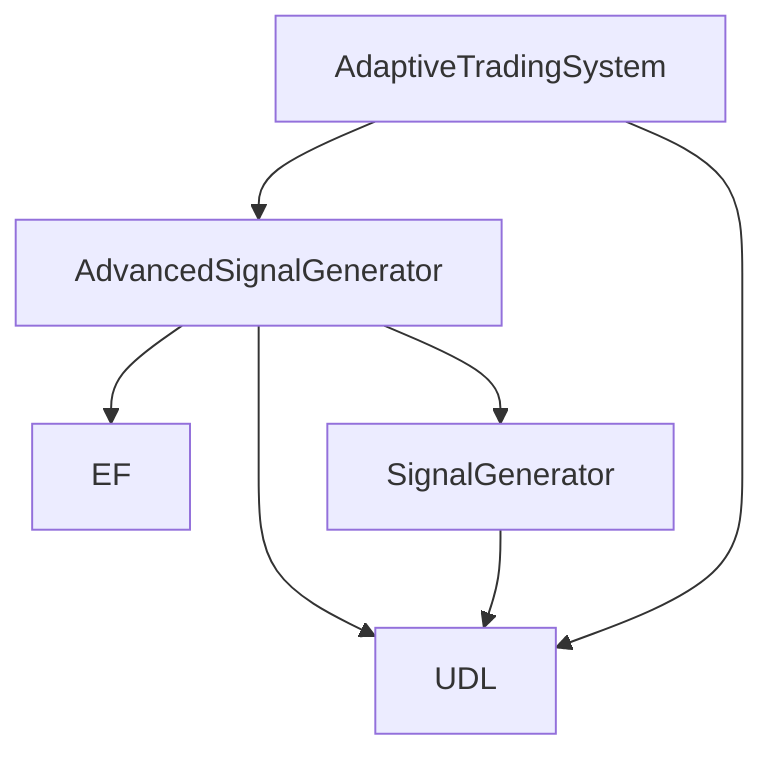
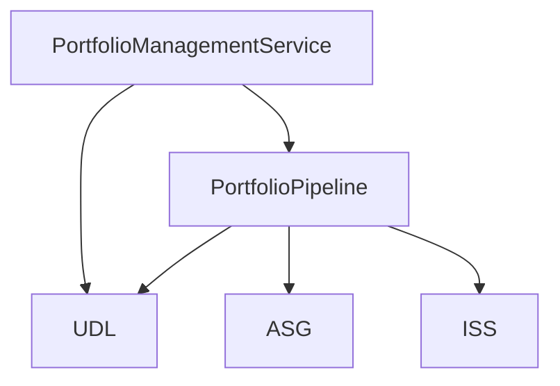
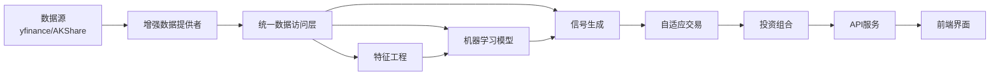
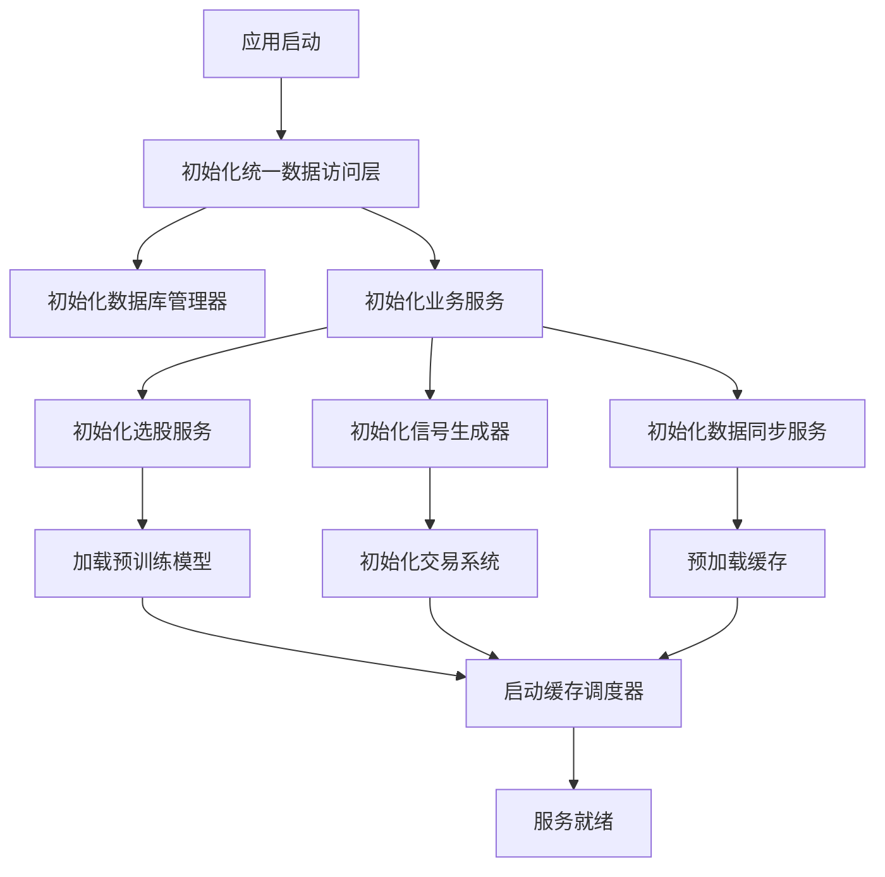

# 股票评估系统 - 模块依赖关系图

## 1. 整体架构依赖图

## 2. 核心模块详细依赖

### 2.1 API服务层依赖

### 2.2 机器学习模块依赖

### 2.3 交易信号模块依赖

### 2.4 投资组合模块依赖

## 3. 数据流依赖链

## 4. 服务初始化依赖顺序

## 5. 关键依赖说明

### 5.1 核心依赖
- **pandas**: 数据处理和分析
- **numpy**: 数值计算
- **scikit-learn**: 机器学习算法
- **xgboost/lightgbm/catboost**: 梯度提升算法
- **fastapi**: Web服务框架
- **sqlalchemy**: 数据库ORM
- **redis**: 缓存服务
- **yfinance/akshare**: 股票数据源

### 5.2 模块间耦合度
- **低耦合**: API层与业务逻辑层通过接口解耦
- **中耦合**: 机器学习模块与数据访问层紧密协作
- **高耦合**: 统一数据访问层是所有模块的基础依赖

### 5.3 循环依赖处理
- 使用延迟导入（lazy import）避免循环依赖
- 通过统一数据访问层作为中介减少直接依赖
- 服务层采用依赖注入模式降低耦合度

## 6. 扩展性设计

### 6.1 横向扩展
- 数据访问层支持多数据源并发访问
- 机器学习模块支持分布式训练
- 交易信号模块支持多策略并行

### 6.2 纵向扩展
- 统一数据访问层支持缓存分层
- 特征工程支持特征插件扩展
- 投资组合管理支持多策略组合

### 6.3 插件化架构
- 数据源插件化，支持新数据源接入
- 机器学习算法插件化，支持新算法集成
- 交易策略插件化，支持自定义策略开发