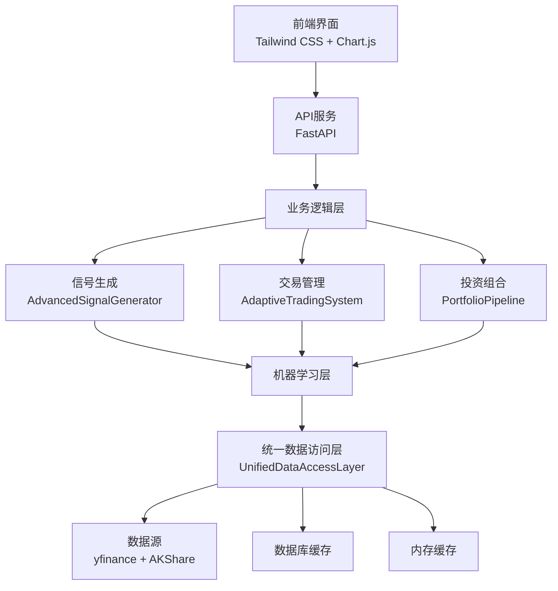

# 智能股票评估系统 - 完整项目说明

## 1. 项目概述

智能股票评估系统是一个基于机器学习的现代化股票分析和交易平台，专为量化投资者和金融机构设计。系统采用分层架构设计，集成多种先进的人工智能技术，提供从数据处理到交易决策的全流程解决方案。

### 核心价值主张
- **智能化决策**：利用机器学习算法进行股票预测和信号生成
- **多维度分析**：支持技术分析、基本面分析和市场情绪分析
- **风险管理**：内置完善的风险控制机制，保护投资安全
- **实时响应**：支持实时数据获取和快速决策响应
- **模块化设计**：灵活的架构设计，支持功能扩展和定制

### 主要功能特性

#### 1.1 智能选股系统
- **多因子选股**：基于技术指标、财务数据、市场情绪等多维度因子
- **机器学习预测**：集成XGBoost、LightGBM、CatBoost等主流算法
- **动态评分机制**：结合模型预测、信号强度和风险评估的综合评分
- **实时股票池管理**：支持自定义股票池和动态调整

#### 1.2 信号生成与交易系统
- **多时间框架分析**：支持日线、周线、月线等多个时间维度
- **智能信号过滤**：基于市场环境和历史表现的信号优化
- **自适应交易策略**：根据市场状态动态调整交易参数
- **完整的交易流程**：从信号生成到订单执行的全流程管理

#### 1.3 投资组合管理
- **风险平价配置**：基于风险贡献的资产配置策略
- **动态仓位管理**：根据市场波动性和风险偏好调整仓位
- **止损止盈机制**：多层次的止损止盈保护
- **绩效归因分析**：详细的投资组合表现分析

#### 1.4 数据处理与分析
- **统一数据访问**：整合多个数据源，提供一致的数据接口
- **多级缓存机制**：L0/L1/L2三级缓存，确保数据访问效率
- **数据质量监控**：实时数据质量检查和异常处理
- **历史数据回测**：支持长期历史数据的策略回测

## 2. 技术架构

### 2.1 系统架构概览

系统采用现代化的分层架构设计，从数据源到用户界面分为六个层次：

```
┌─────────────────────────────────────────────────────────────┐
│                    前端展示层                              │
│              Tailwind CSS + Chart.js                       │
├─────────────────────────────────────────────────────────────┤
│                    API服务层                              │
│                  FastAPI框架                               │
├─────────────────────────────────────────────────────────────┤
│                  业务逻辑层                                │
│  信号生成引擎    │    交易管理    │    投资组合管理         │
├─────────────────────────────────────────────────────────────┤
│                  机器学习层                                │
│  特征工程    │    模型训练    │    预测推理    │  模型管理  │
├─────────────────────────────────────────────────────────────┤
│                  数据访问层                                │
│              统一数据访问层                                 │
├─────────────────────────────────────────────────────────────┤
│                    数据源层                                │
│    yfinance    │    AKShare    │    数据库    │   缓存     │
└─────────────────────────────────────────────────────────────┘
```

### 2.2 核心模块设计

#### 统一数据访问层 (Unified Data Access Layer)
- **功能职责**：提供统一的数据访问接口，屏蔽底层数据源的差异
- **核心特性**：
  - 多级缓存机制（L0内存缓存、L1本地缓存、L2数据库缓存）
  - 数据质量校验和异常处理
  - 自动数据同步和更新
  - 性能监控和统计
- **主要组件**：
  - `UnifiedDataAccessLayer`：核心数据访问类
  - `DataSyncService`：数据同步服务
  - `DataQualityChecker`：数据质量检查器

#### 机器学习模块 (ML Module)
- **功能职责**：负责特征工程、模型训练和预测推理
- **核心特性**：
  - 支持多种机器学习算法（XGBoost、LightGBM、CatBoost、线性模型）
  - 自动化特征工程和选择
  - 模型性能评估和优化
  - 集成学习（Stacking）支持
- **主要组件**：
  - `EnhancedFeatureGenerator`：特征工程生成器
  - `UnifiedModelTrainer`：统一模型训练器
  - `EnhancedMLTrainer`：增强ML训练器
  - `ModelPerformanceEvaluator`：模型性能评估器

#### 信号生成模块 (Signal Generation)
- **功能职责**：基于多时间框架分析生成交易信号
- **核心特性**：
  - 多时间框架技术分析
  - 智能信号过滤和优化
  - 市场环境识别
  - 风险管理集成
- **主要组件**：
  - `AdvancedSignalGenerator`：高级信号生成器
  - `MultiTimeframeAnalyzer`：多时间框架分析器
  - `SignalFilter`：信号过滤器
  - `MarketRegimeDetector`：市场环境识别器

#### 交易管理模块 (Trading Management)
- **功能职责**：管理交易执行和风险控制
- **核心特性**：
  - 自适应交易策略
  - 动态仓位管理
  - 止损止盈机制
  - 交易成本考虑
- **主要组件**：
  - `AdaptiveTradingSystem`：自适应交易系统
  - `PositionSizer`：仓位管理器
  - `StopLossCalculator`：止损计算器
  - `PerformanceMonitor`：性能监控器

#### 投资组合模块 (Portfolio Management)
- **功能职责**：管理投资组合的构建和优化
- **核心特性**：
  - 智能选股和评分
  - 风险平价配置
  - 动态调仓策略
  - 绩效归因分析
- **主要组件**：
  - `PortfolioPipeline`：投资组合流水线
  - `IntelligentStockSelector`：智能选股器
  - `RiskManager`：风险管理器
  - `PortfolioOptimizer`：组合优化器

## 3. 模块依赖关系

### 3.1 核心依赖链



### 3.2 详细模块依赖

#### 数据流依赖
```
数据源(yfinance, AKShare)
    ↓
统一数据访问层(UnifiedDataAccessLayer)
    ↓
特征工程(EnhancedFeatureGenerator)
    ↓
机器学习模型(UnifiedModelTrainer)
    ↓
信号生成(AdvancedSignalGenerator)
    ↓
交易决策(AdaptiveTradingSystem)
    ↓
投资组合管理(PortfolioPipeline)
```

#### 服务层依赖
```
API服务层(app.py)
├── 统一数据访问层初始化
├── 智能选股服务初始化
├── 信号生成器初始化
├── 股票列表管理器初始化
└── 数据缓存预热
```

## 4. 使用方式

### 4.1 环境配置

#### 系统要求
- Python 3.8+
- Node.js 14+ (可选，用于前端开发)
- MySQL/PostgreSQL (可选，用于数据存储)
- 8GB+ RAM (推荐，用于机器学习训练)

#### 环境变量配置
创建 `.env` 文件，配置以下参数：

```bash
# 大模型配置
OPENAI_API_KEY=your_openai_api_key
OPENAI_API_BASE=https://api.openai.com/v1
OPENAI_MODEL=gpt-4

# 本地大模型配置 (可选)
LOCAL_MODEL_PATH=./models
LOCAL_MODEL_NAME=your_local_model

# 数据库配置 (可选)
DB_HOST=localhost
DB_PORT=3306
DB_USER=your_username
DB_PASSWORD=your_password
DB_NAME=stock_evaluation

# 缓存配置
CACHE_ENABLED=true
CACHE_TTL=3600

# 日志配置
LOG_LEVEL=INFO
LOG_FILE=logs/app.log
```

### 4.2 安装步骤

#### 1. 克隆项目
```bash
git clone <repository-url>
cd stock-evaluation3
```

#### 2. 安装Python依赖
```bash
pip install -r requirements.txt
```

#### 3. 安装Node.js依赖 (可选)
```bash
cd static
npm install
npm run build
```

#### 4. 配置环境变量
```bash
cp .env.example .env
# 编辑 .env 文件，填入必要的配置信息
```

#### 5. 初始化数据库 (可选)
```bash
python scripts/init_database.py
```

### 4.3 启动系统

#### 启动后端服务
```bash
# 方式1: 直接启动
python main.py

# 方式2: 使用uvicorn启动
uvicorn src.apps.api.app:app --host 0.0.0.0 --port 8000 --reload
```

#### 启动前端界面
```bash
# 如果已安装Node.js依赖
cd static
npm run dev

# 或者直接打开静态文件
open static/index.html
```

### 4.4 功能使用

#### 智能选股
1. 访问系统主页 `http://localhost:8000`
2. 选择"智能选股"模块
3. 设置选股参数（股票池、筛选条件、评分权重）
4. 点击"开始选股"按钮
5. 查看选股结果和详细分析报告

#### 个股分析
1. 输入股票代码（如：000001.SZ、AAPL）
2. 选择分析类型（技术分析、基本面分析、综合分析）
3. 设置分析参数（时间范围、技术指标、模型选择）
4. 查看分析结果和预测建议

#### 投资组合管理
1. 创建投资组合
2. 添加股票到组合
3. 设置组合参数（初始资金、风险水平、调仓频率）
4. 运行回测分析
5. 查看组合表现和风险指标

#### 系统监控
1. 查看系统状态面板
2. 监控数据同步状态
3. 查看模型性能指标
4. 检查系统日志和告警

### 4.5 高级配置

#### 机器学习模型配置
```python
# 在配置文件中设置模型参数
ML_MODELS = {
    'classification': ['xgboost', 'lightgbm', 'catboost'],
    'regression': ['xgboost', 'lightgbm', 'linear'],
    'ensemble': true,
    'feature_selection': 'auto',
    'cross_validation': 5
}
```

#### 交易策略配置
```python
# 设置交易参数
TRADING_CONFIG = {
    'stop_loss': 0.05,      # 5%止损
    'take_profit': 0.15,    # 15%止盈
    'max_position': 0.1,    # 最大仓位10%
    'rebalance_frequency': 'M'  # 月度调仓
}
```

#### 数据源配置
```python
# 配置数据源优先级
DATA_SOURCES = {
    'priority': ['yfinance', 'akshare', 'tushare'],
    'cache_level': 2,       # L2缓存
    'sync_interval': 300,   # 5分钟同步一次
    'quality_check': true
}
```

## 5. 核心特性详解

### 5.1 机器学习驱动的智能分析

#### 特征工程
- **技术指标**：移动平均线、RSI、MACD、布林带等
- **基本面指标**：PE、PB、ROE、营收增长率等
- **市场情绪**：成交量变化、波动率、相关性等
- **文本特征**：新闻情感分析、研报关键词提取

#### 模型训练
- **分类模型**：预测股票涨跌概率
- **回归模型**：预测收益率和价格目标
- **集成学习**：多模型融合提高预测准确性
- **在线学习**：支持模型持续更新和优化

#### 模型评估
- **准确率**：预测正确的比例
- **召回率**：捕捉上涨股票的能力
- **F1分数**：准确率和召回率的调和平均
- **夏普比率**：风险调整后收益

### 5.2 多时间框架信号系统

#### 时间框架
- **短线交易**：5分钟、15分钟、1小时
- **中线交易**：日线、周线
- **长线投资**：月线、季线

#### 信号类型
- **趋势信号**：基于移动平均线、趋势线
- **动量信号**：基于RSI、MACD、KDJ
- **成交量信号**：基于成交量变化和量价关系
- **波动率信号**：基于布林带、ATR等指标

#### 信号过滤
- **市场环境过滤**：识别牛市、熊市、震荡市
- **相关性过滤**：避免过度集中的相似信号
- **历史表现过滤**：基于信号历史成功率筛选
- **风险控制过滤**：结合止损止盈要求

### 5.3 完善的风险管理体系

#### 风险评估
- **市场风险**：整体市场波动对组合的影响
- **行业风险**：行业集中度风险
- **个股风险**：单一股票的特定风险
- **流动性风险**：交易流动性不足的风险

#### 风险控制
- **仓位控制**：根据风险水平动态调整仓位
- **止损机制**：多层次止损保护
- **分散投资**：行业和个股的双重分散
- **压力测试**：极端市场情况下的风险测试

#### 风险监控
- **实时VaR**：风险价值的实时计算
- **最大回撤**：历史最大回撤监控
- **夏普比率**：风险调整后收益监控
- **相关性监控**：组合内资产相关性变化

### 5.4 高效的数据处理架构

#### 数据获取
- **多数据源**：整合yfinance、AKShare等多个数据源
- **实时更新**：支持实时数据获取和更新
- **历史数据**：完整的股票历史数据
- **财务数据**：详细的财务报表数据

#### 数据存储
- **多级缓存**：内存缓存、本地缓存、数据库缓存
- **数据压缩**：高效的数据压缩和存储
- **数据备份**：定期数据备份和恢复
- **数据安全**：数据加密和访问控制

#### 数据处理
- **并行处理**：支持多线程和分布式处理
- **增量更新**：高效的增量数据更新
- **数据清洗**：自动数据清洗和异常处理
- **数据质量**：实时数据质量监控

## 6. 性能优化

### 6.1 计算性能
- **向量化计算**：使用NumPy和Pandas进行向量化计算
- **并行处理**：多线程和进程池并行处理
- **GPU加速**：支持GPU加速的机器学习训练
- **缓存优化**：智能缓存策略减少重复计算

### 6.2 存储性能
- **数据压缩**：高效的数据压缩算法
- **索引优化**：数据库索引优化
- **分片存储**：大表分片存储提高查询效率
- **冷热分离**：冷热数据分离存储

### 6.3 网络性能
- **连接池**：数据库连接池管理
- **异步处理**：异步I/O提高并发能力
- **CDN加速**：静态资源CDN加速
- **压缩传输**：数据压缩传输减少网络负载

## 7. 扩展性设计

### 7.1 模块化架构
- **插件化设计**：支持功能模块的插件化扩展
- **接口标准化**：统一的模块间接口标准
- **配置驱动**：通过配置控制功能启用和参数
- **热插拔**：支持运行时的模块加载和卸载

### 7.2 分布式支持
- **微服务架构**：支持微服务化部署
- **负载均衡**：支持多实例负载均衡
- **数据分片**：支持数据的水平分片
- **集群管理**：支持集群模式部署

### 7.3 算法扩展
- **算法插件**：支持新的机器学习算法插件
- **特征扩展**：支持自定义特征工程
- **模型集成**：支持多种模型集成方式
- **策略扩展**：支持自定义交易策略

## 8. 部署方案

### 8.1 单机部署
适合个人用户和小型团队：
```bash
# 安装依赖
pip install -r requirements.txt

# 配置环境
cp .env.example .env
# 编辑.env文件

# 启动服务
python main.py
```

### 8.2 容器化部署
使用Docker进行容器化部署：
```dockerfile
FROM python:3.9-slim

WORKDIR /app
COPY requirements.txt .
RUN pip install -r requirements.txt

COPY . .
EXPOSE 8000

CMD ["uvicorn", "src.apps.api.app:app", "--host", "0.0.0.0", "--port", "8000"]
```

### 8.3 云部署
支持主流云平台部署：
- **AWS**：EC2、RDS、ElastiCache
- **阿里云**：ECS、RDS、Redis
- **腾讯云**：CVM、TencentDB、TencentCache

## 9. 监控与运维

### 9.1 系统监控
- **性能监控**：CPU、内存、磁盘、网络使用率
- **应用监控**：请求响应时间、错误率、并发数
- **业务监控**：选股成功率、模型准确率、收益指标
- **数据监控**：数据更新延迟、数据质量指标

### 9.2 日志管理
- **结构化日志**：JSON格式的结构化日志
- **日志分级**：DEBUG、INFO、WARNING、ERROR等级别
- **日志轮转**：自动日志文件轮转和归档
- **日志分析**：ELK Stack日志分析平台

### 9.3 告警机制
- **阈值告警**：关键指标的阈值告警
- **异常告警**：系统异常和错误告警
- **业务告警**：业务指标异常告警
- **多渠道通知**：邮件、短信、Webhook通知

## 10. 安全与合规

### 10.1 数据安全
- **数据加密**：敏感数据加密存储和传输
- **访问控制**：基于角色的访问控制
- **数据脱敏**：敏感信息脱敏处理
- **备份恢复**：定期数据备份和恢复测试

### 10.2 系统安全
- **身份认证**：多因素身份认证
- **权限管理**：细粒度的权限控制
- **安全审计**：完整的操作审计日志
- **漏洞扫描**：定期安全漏洞扫描

### 10.3 合规要求
- **数据合规**：符合数据保护法规要求
- **金融监管**：满足金融行业的监管要求
- **隐私保护**：用户隐私信息保护
- **审计要求**：支持内外部审计需求

---

## 总结

智能股票评估系统是一个功能完整、架构先进的股票分析和交易平台。系统通过机器学习技术提供智能化的投资决策支持，采用现代化的技术栈确保系统的性能和可靠性。完善的架构设计和模块化实现使得系统具备良好的扩展性和维护性，能够满足不同用户的个性化需求。

系统的主要优势包括：
- **技术先进性**：采用最新的机器学习算法和技术架构
- **功能完整性**：覆盖从数据分析到交易执行的全流程
- **架构合理性**：分层架构设计，模块化实现
- **性能优越性**：多级缓存、并行处理等性能优化
- **安全可靠性**：完善的安全机制和风险控制

通过持续的技术创新和功能优化，系统将为用户提供更加智能、高效、安全的股票投资服务。